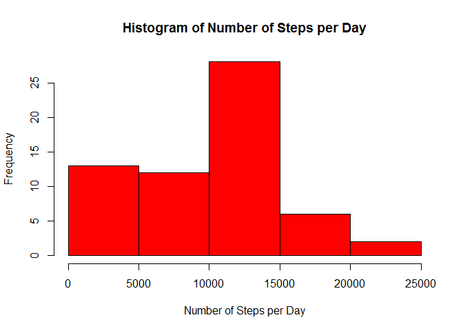
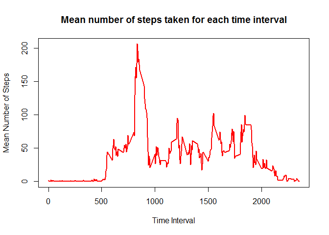
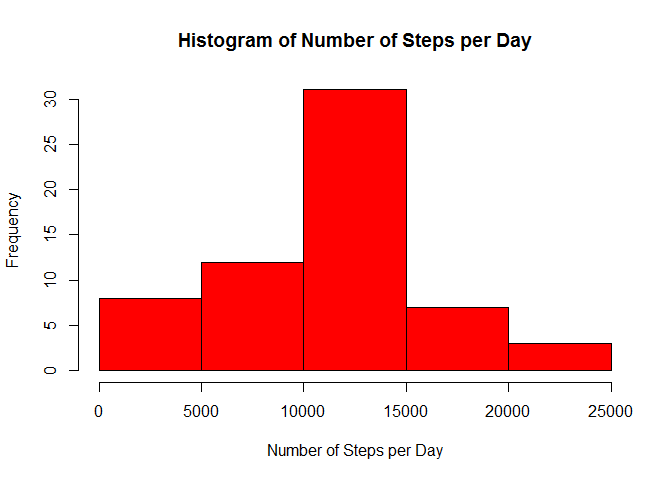
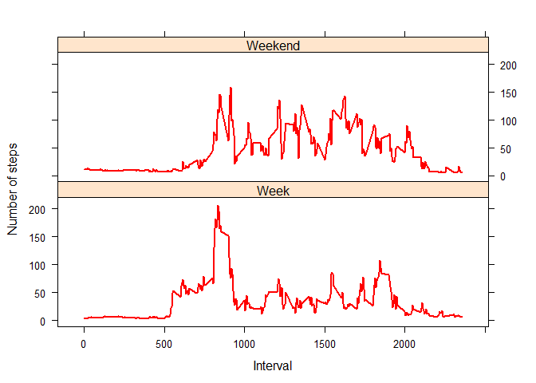

# Reproducible Research: Peer Assessment 1

It is now possible to collect a large amount of data about personal movement using activity monitoring devices such as a Fitbit, Nike Fuelband, orJawbone Up. These type of devices are part of the "quantified self" movement - a group of enthusiasts who take measurements about themselves regularly to improve their health, to find patterns in their behavior, or because they are tech geeks. But these data remain under-utilized both because the raw data are hard to obtain and there is a lack of statistical methods and software for processing and interpreting the data.

This assignment makes use of data from a personal activity monitoring device. This device collects data at 5 minute intervals through out the day. The data consists of two months of data from an anonymous individual collected during the months of October and November, 2012 and include the number of steps taken in 5 minute intervals each day.


## Loading and preprocessing the data

First, we unzip and load the data:


```r
#Unzip the file
unzip ("activity.zip")

#Read the file into the rawdata data frame
rawdata <- read.csv("activity.csv")
```

Process the data to ensure that the dates are recognised as being in date format:


```r
#Convert the date column to be recgnised as a date
rawdata$date <- as.Date(rawdata$date,"%Y-%m-%d")
```


## What is mean total number of steps taken per day?

To calculate the mean total number of steps taken per day, first aggregate the raw data by the date, ignoring any missing values as specified in the assignment instructions:


```r
#Aggregate the data to give the total number of steps for each date
dailydata <- aggregate(rawdata$steps, by=list(rawdata$date), FUN=sum, na.rm=TRUE)
```

Produce a histogram of the number of steps per day:


```r
#Plot a histogram for the total number of steps per day
hist(dailydata$x, main="Histogram of Number of Steps per Day",xlab="Number of Steps per Day",col="red")
```

 

Create a data frame to summarise of the mean and median number of steps per day:


```r
#create a data frame which will store the mean and median number of steps
summary <- data.frame(2,2)

#Define the names of the rows in the summary data frame
titles <- c("Mean Number of Steps","Median Number of Steps")
summary[1:2,1] <- titles

#Calculate the mean and median number of steps and add these to the data frame
meansteps <- mean(dailydata$x)
mediansteps <- median(dailydata$x)
summary[1:2,2] <- c(as.integer(meansteps),as.integer(mediansteps))

#Define the names of the columns in the summary data frame
names(summary) <- c("Measurement","Value")

#Print the resulting table
print(summary)
```

```
##              Measurement Value
## 1   Mean Number of Steps  9354
## 2 Median Number of Steps 10395
```


## What is the average daily activity pattern?

Aggregate the data to give the mean number of steps for each interval, averaged over all dates:


```r
#Aggregate the data by the time interval, to show the mean number of steps across all days
intervaldata <- aggregate(rawdata$steps, by=list(rawdata$interval), FUN=mean, na.rm=TRUE)
names(intervaldata) <- c("interval","steps")
```

Plot the data as a time series to show the average number of steps taken per interval, averaged across all days:


```r
#Produce a time series plot of the average number of steps taken in each time interval, across all days
plot(intervaldata$interval,intervaldata$steps,type="l",col="red",main="Mean number of steps taken for each time interval",xlab="Time Interval",ylab="Mean Number of Steps",lwd=2)
```

 

Find the interval with the maximum number of steps on average across all days:


```r
#Select the time interval corresponding to the maximum value of the average number of steps
intervaldata[which.max(intervaldata$steps),1]
```

```
## [1] 835
```


## Imputing missing values

Calculate the total number of rows in the raw dataset which contain NAs:


```r
#Calculate the logical vector showing TRUE for rows which contain at least one NA value
incompletedata <- !complete.cases(rawdata$steps)

#Count the number of rows containing at least one NA
sum(incompletedata)
```

```
## [1] 2304
```

Imput values for the Number of Steps values whch are currently NA:


```r
#Create a data frame with 2304 rows (the total number of NA values)
nadata <- rawdata[incompletedata,]

#Join the NAs in this dataframe with the mean number of steps for that interval from the interval dataset
newdata <- merge(nadata,intervaldata,by="interval",all.x=TRUE)
imputedata <- newdata$steps.y

#Take a copy of the raw data in which the NA values will be populated
completedata <- rawdata

#Replace the NA values within this data with the average step values for the corresponding interval
completedata[incompletedata,"steps"] <- imputedata
```

We can see that the NA values have now been replaced by looking first at a few rows in the original raw data:


```r
print(rawdata[c(1,10,17),])
```

```
##    steps       date interval
## 1     NA 2012-10-01        0
## 10    NA 2012-10-01       45
## 17    NA 2012-10-01      120
```

and comparing this with the same rows in the complete dataset:


```r
print(completedata[c(1,10,17),])
```

```
##        steps       date interval
## 1  1.7169811 2012-10-01        0
## 10 0.3396226 2012-10-01       45
## 17 0.1320755 2012-10-01      120
```

Here, the NAs have been replaced by the interval average.

Now we repeat the activity in the Section named "What is mean total number of steps taken per day?", and compare the results to the same analysis using the new dataset with the NA values filled in.

First plot the histogram:


```r
#Aggregate the data to give the total number of steps for each date
completedailydata <- aggregate(completedata$steps, by=list(completedata$date), FUN=sum, na.rm=TRUE)

#Plot a histogram for the total number of steps per day
hist(completedailydata$x, main="Histogram of Number of Steps per Day",xlab="Number of Steps per Day",col="red")
```

 

Populating the NA values has a fairly significant impact on the count of the lower category (0-5000 steps), but only a small effect on the other categories.

Now we calculate the new mean and median numbers of steps taken per day:


```r
#create a data frame which will store the mean and median number of steps
completesummary <- data.frame(2,2)

#Define the names of the rows in the summary data frame
completetitles <- c("Mean Number of Steps","Median Number of Steps")
completesummary[1:2,1] <- completetitles

#Calculate the mean and median number of steps and add these to the data frame
completemeansteps <- mean(completedailydata$x)
completemediansteps <- median(completedailydata$x)
completesummary[1:2,2] <- c(as.integer(completemeansteps),as.integer(completemediansteps))

#Define the names of the columns in the summary data frame
names(completesummary) <- c("Measurement","Value")

#Print the resulting table
print(completesummary)
```

```
##              Measurement Value
## 1   Mean Number of Steps 10766
## 2 Median Number of Steps 11015
```

Filling in the NA values with the interval averages also has a reasonably significant impact on the mean and median values of the total number of steps per day. Both values are 5-10% larger than when calculated using the original raw data.


## Are there differences in activity patterns between weekdays and weekends?
Add a column to the dataset to categorise whether the date falls during the week or during the weekend:


```r
#Add a column to give the weekday corresponding to the date 
completedata$weekday <- weekdays(completedata$date)

#Add another column to categorise whether the day falls in the week or the weekend
weekenddays <- c("Saturday","Sunday")
completedata$weekflag <- ifelse(completedata$weekday %in% weekenddays,'Weekend','Week')
```

Test that the new columns function as expected by printing a selection of rows from the data:


```r
print(completedata[c(1,700,1600),])
```

```
##           steps       date interval   weekday weekflag
## 1      1.716981 2012-10-01        0    Monday     Week
## 700    0.000000 2012-10-03     1015 Wednesday     Week
## 1600 511.000000 2012-10-06     1315  Saturday  Weekend
```

Produce a panel plot to compare the time series plots of the 5-minute interval and the average number of steps taken, averaged across all weekday days or weekend days:


```r
#Average the data to give the mean number of steps in a day by interval and week/weekend
finaldata <- aggregate(completedata$steps, by=list(completedata$weekflag,completedata$interval), FUN=mean, na.rm=TRUE)
names(finaldata) <- c("weekflag","interval","steps")

#Use the lattice package
library(lattice)

#Produce a panel plot of the data to compare the average number of steps on a weekday compared to the weekend
xyplot(steps ~ interval | weekflag, finaldata, type="l", lwd=2, xlab="Interval", ylab="Number of steps", col="red", layout=c(1,2))
```

 
